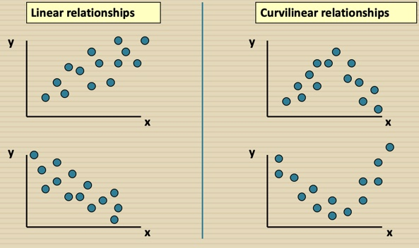

```{r setup, include=FALSE}
knitr::opts_chunk$set(echo = FALSE)
library(tidyverse)
library(plotly)
library(gt)
```


## What is Statistics?

Statistics is a collection of tools and methods applied to **data** which helps managers to:

- Make Decisions
- Analyze Data
- Identify Patterns, Trends, and Relationships
- Identify and understand variation
- Use samples to draw conclusions about the population

## Statistical Decision Making

Statistics is the field of study dealing with the collection, analysis, presentation and interpretation of data, and how to interpre data as evidence to make decisions when faced with uncertainty. Statistical Decision making is done in 4 major steps:

- Identify the relevant population and variables
- Locate the data
- Analyze the data
- Generate a statistical report

##


## Data

Data is information, especially facts or numbers, collected to be examined and considered and used to help decision-making - Cambridge Dictionary

For information to be data, it must have context:

- **Who** are the individuals being measured or counted?
- **What** has been measured or counted?
- **When** or for which time period were the data measured?
- **hoW** were the data measured and recorded?
- **Why** were the data measured and recorded?

## Data Types

- **Categorical:**
  - Often recorded as names, but can be recorded as numerals
    - Ex: Grade level, county, gender
  - Usually dealt with by counting how many cases fall within each particular category

- **Quantitative:**
  - Measurements or counts of something
    - Ex: Dollars, cases, temperature
  - **ALWAYS** has units of measure attached


## Data Types

- **Cross Section:**
  - data collected during a single time period
  - snapshot of similar things: stores, workers, cities

- **Time Series:**
  - data collected at regular time intervals
    - hour, day, week, month, quarter, year
  - distinct business feature: relies on time series
  - businesses and government are ongoing institutions

## How Data is Summarized and Displayed 

- **Univariate Analysis: Single Variable (Center/Shape/Spread)**
  - *Descriptive Statistics*
    - Center (mean, median, mode)
    - Shape (unimodal, symmetric)
    - Spread (standard deviation, high/low, range)
  - *Histograms* of frequency distribution
- **Bivariate Analysis: Relate two variables (Direction/Strength/Form)**
  - Correlation, Regression Equations
  - Scatterplots, Trend Lines
- **Multivariate Analysis: Relate three or more variables**
  - Regression Equations and ANOVA Models
  - Often times, data in 3 or more dimensions is hard to visualize
  
## Univariate analysis: Center
  
- Population Mean: $\mu = \frac{\sum_{i=1}^{N}x_{i}}{N}$ where $N$ is the size of the population, $x_{i}$ is the value for each member of the population  .

```{r, echo = T}
grades <- c(78,79,80,81,82)
mean(grades)
```
  
- Median: The middle value in a sorted list. If the dataset is an even amount, you take the average of the two closest values to the center

```{r, echo = T}
median(grades)
```

- Mode: Which value occurred the most, also tells you if the distribution is unimodal


## Univariate analysis: Shape

The mode can help tell you the distribution, however the easiest way is with a histogram. Also another way to see if the distribution is symmetric is if the mean is approximately equal to the median.

If the mean is greater than the median, then it is skewed-right, if it is less than the median, then it is skewed left
```{r, echo = F, fig.width=8,fig.height=3}
bins <- seq(10,34,by = 2)

mpg <- cut(mtcars$mpg,bins)

freqDist <- table(mpg) %>% data.frame()

ggplot(freqDist, aes(mpg,Freq))+ 
  geom_col(col = 'black', fill = 'darkblue', alpha = 0.75)+
  labs(title = 'Distribution of Miles Per Gallon',
       caption = "Data is from 1974 Motor Trend US Magazine",
       y = 'Frequency',
       x= "Miles Per Gallon")+
  theme_bw()
```

## Univariate Analysis: Spread

- Variance: $\sigma^{2} = \frac{\sum_{i}^{N}(x_{i}-\mu)^{2}}{N-1} =$ Sum of squared deviations of $x_{i}$ from $\mu$ divided by degrees of freedom

```{r, echo = T}
var(grades)
```

- Standard Deviation = $\sigma = \sqrt{\sigma^{2}} =$ Square root of variance

```{r, echo = T}
sd(grades)
```

- Interquartile Range (IQR): Difference between the 75th and 25th percentile

```{r, echo = T}
IQR(grades)
```

## Normal Distribution and the Z-Score


The Z-Score tells you how many standard deviations ($\sigma$) an observation $x_{i}$ is from the mean ($\mu$) where $Z = \frac{x_{i}-\mu}{\sigma}$

## Predictions of a Univariate Model with a Normal Distribution

If the population is unimodal and symmetric then: 
$$Prediction = \mu \pm cv*\sigma$$
where $\mu =$ population mean, $cv =$ critical value = Z-value, $\sigma =$ standard deviation. 

If you want 68%, 95%, or 99% accuracy, the critical values are 1,2,3 respectively. Some businesses like using 1.3 as the critical value for 80% confidence.

## Univariate Data that is not Normally Distributed

In many business applications, you will find that varaibles do not always follow a normal distribution. There are many reasons such as:

- Bi or Multimodal
  - There might be an underlying reason as to why there are multiple modes, you may want to break them down by different categories
  
- Outliers

## Univariate Outliers

- Clearly larger or smaller than the rest of the data
- Can find using histograms
- **Mean** and **standard deviation** are very sensitive to outliers
  - If you have both high and low outliers, the mean will not be affected much as the outliers would cancel eachother out, but outliers always increase the standard deviation
- The median is not affected by outliers
  - median is a resistant measure because it is ordinal
  - You will see large differences between the mean and median as a result
- You can also detect outliers using Tukey's Fences:
  - Lower fence: $Q1 - 1.5*IQR$
  - Upper fence: $Q3 + 1.5*IQR$
  
## Starwars Mass Example

```{r, message = F, warning = F, fig.width=8,fig.height=3}
ggplot(starwars, aes(height))+ 
  geom_histogram(binwidth = 15,col = 'black', fill = 'darkblue', alpha = 0.75)+
  labs(title = 'Distribution of Height of Star Wars Characters')+
  theme_bw()
```

```{r, echo = T}
mean(starwars$height,na.rm = T)
median(starwars$height,na.rm = T)
sd(starwars$height,na.rm = T)
```

## Box Plot


## Bivariate Statistics: Correlation

This measure helps determine if there is a strong linear relationship between two quantitative variables.

- Unit free
- Range is [-1, 1]
- Closer to -1, the stronger the negative linear relationship
- Closer to 1, the stronger the positive linear relationship
- Closer to 0, the weaker the linear relationship
- Correlation is not causation. The correlation between $x$ and $y$ is the same as $y$ and $x$, so it tells you nothing about causation. In fact, there might be a lurking variable that is impacting both

```{r, echo = T}
hours <- c(3,2,2,5,4)
cor(grades,hours)

```

## Linear vs Curvilinear Relationships



## Strength of Linear Relationships


## Outliers and Correlation


## Time Series Graph

This is the nearly the same as the scatterplot, the only difference is that time is on the x-axis

Also, there is typically a straight line through the chart called the trend-line

```{r,fig.height=3,fig.width=8, message = F}
data("sp500")

ggplot(sp500, aes(date, high))+
  geom_line(color = 'gray40',alpha = 0.75)+
  geom_smooth(method = "lm", se = F, color = 'darkblue', linetype = 'dashed')+
  theme_bw()+
  labs(title = "Trading Volume of the S&P 500 Over Time",
       subtitle = 'from 1950-2015',
       x = "Date",
       y = "Volume")
```

## Organize, Display, and Summarize Data

- Data Tables
  - organize information in context
- Tally sheets, bar and pie graphs
  - display frequencies
- Histograms
  - display shape, center, spread of univariate quantitative data
- Scatterplots and correlation
  - display and summarize direction, form, strength of bivariate quanitative data
- Trend plot Analysis
  - display and summarize direction, form, strenth of bivariate quantitative tim series data
- Equations
  - summarize two or more variables

## Summary of Key Terms

- A *frequency distribution* is a table that reports the number of times each numerical value or grouping of values occurs in quantitative data.
- The *mode* is the most frequently occurring value in the data. 
- A *histogram* is a bar graph display of a frequency distribution with the frequencies represented by bar heights.
- A *class* is an interval of values for a frequency distribution and the corresponding histogram bar.  In software programming it is referred to as the bin. The bin is defined by *class width* and *cut points*, which are the beginning and ending values of each class. 
- A frequency distribution is *symmetric* if the left half of the histogram is the mirror image of the right half.
- A frequency distribution is *unimodal* if the histogram has one mode or modal class and is bimodal if the histogram bars group around two separate modes.
- A unimodal distribution is *skewed right* if its histogram has a long tail to the right of its modal class and *skewed left* if its tail lies only to the left.
- A *time series graph* is a two-dimensional plot of time series data with the time series variable plotted on the vertical axis and time itself plotted on the horizontal axis.
- A *trend line* is a straight line that approximates the linear relationship between a time series variable and time itself.  The slope of the trend line is the trend rate.
- A *scatterplot* is a two-dimensional plot of bivariate data in which each observation is represented as a plotted point on the graph and the coordinates of each point measure the values of each of the two variables for the corresponding observation.


## R and RStudio

- Why R?
  - Open source
  - Easier to learn than python
    - Not whitespace sensitive
    - Easy to install packages
    - Pairs well with RStudio

- RStudio
  - In my opinion, it is the best graphical user interface (GUI) available
  - Allows for generation of many styles of reports with code embedded
  - Easier to follow along in the coding process

***

## Installing R and RStudio

1.	First, download and install R, which is available at https://www.r-project.org 
2.	After downloading and installing R, RStudio provides an interactive environment for using R, available at https://www.rstudio.com

## Help in R

- There are a bunch of cheatsheets available in RStudio, just click the **Help** at the top of the window then **Cheatsheets**
- Also there is a package called *swirl* that can be used

```{r, echo = T, eval = F}
install.packages("swirl")
library(swirl)
```


## Other Software

We are only going to cover R in this course, however, there are many other languages that are important. Two main languages that are imperative for any individual in this field are:

- SQL: https://mode.com/sql-tutorial/
- python: https://mode.com/python-tutorial/
  - Quantitative Economics: https://quantecon.org/
  
## Optional: Version Control

An important process for any individual is to ensure that you have the ability to track your code or any work. For this course, we will be using *git*. This will act as your version control throughout the course.

If you are using a Mac, open the terminal and run these two lines of code:

- /bin/bash -c "$(curl -fsSL https://raw.githubusercontent.com/Homebrew/install/HEAD/install.sh)"
- brew install git

If you are using Windows:

- https://git-scm.com/download/win